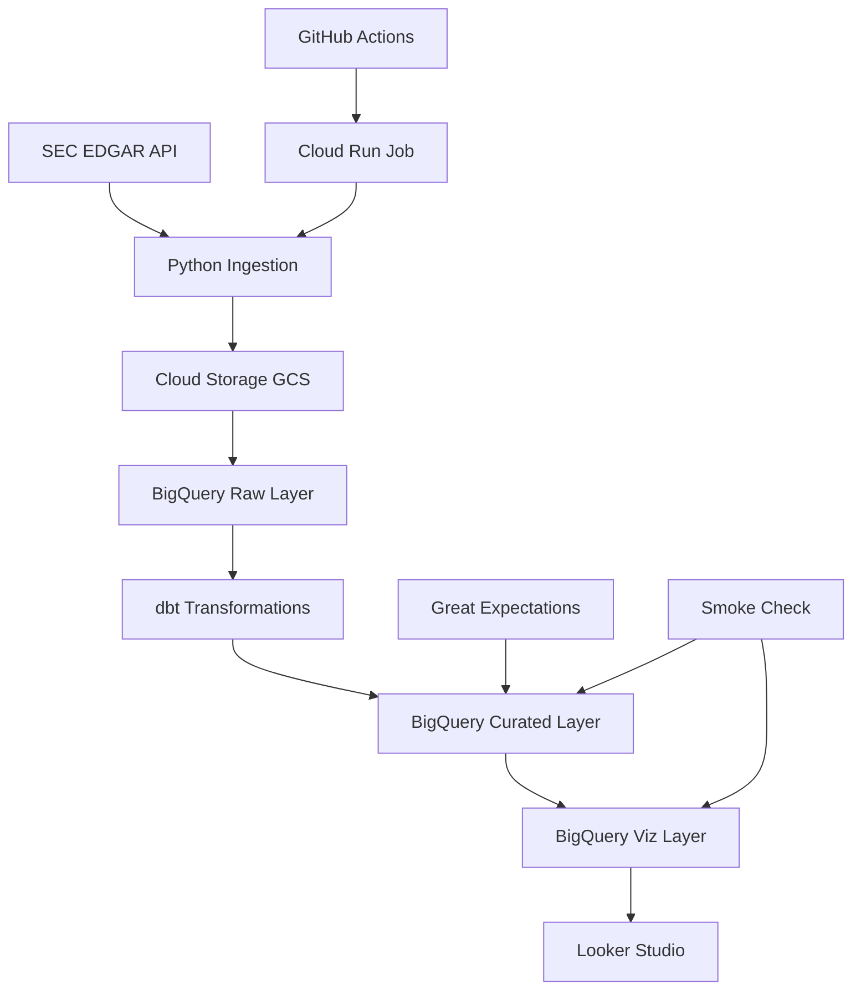

# Architecture Guide

## System Overview

The SEC EDGAR Financials Warehouse is built on Google Cloud Platform using modern data engineering patterns. The architecture follows a medallion pattern with distinct layers for raw ingestion, business logic transformation, and analytics-ready datasets.

## High-Level Architecture



## Components Deep Dive

### 1. Data Ingestion Layer

**Technology**: Python scripts with rate limiting
**Location**: `src/ingest/fetch_sec.py`

```python
# Key features:
- Rate limiting: 10 requests/second (SEC requirement)
- Retry logic with exponential backoff  
- Company facts and submissions data
- NDJSON output format for BigQuery compatibility
```

**Data Sources**:
- `https://data.sec.gov/api/xbrl/companyfacts/CIK{cik}.json`
- `https://data.sec.gov/api/xbrl/submissions/CIK{cik}.json`

### 2. Storage Layer

**Technology**: Google Cloud Storage
**Purpose**: Raw data staging before BigQuery load

```
gs://{bucket}/sec_data/
├── companyfacts/
│   ├── companyfacts_AAPL.ndjson
│   └── companyfacts_MSFT.ndjson
└── submissions/
    ├── submissions_AAPL.ndjson
    └── submissions_MSFT.ndjson
```

### 3. Raw Data Layer (Bronze)

**Dataset**: `sec_raw`
**Technology**: BigQuery tables with auto-schema detection

| Table | Purpose | Schema |
|-------|---------|---------|
| `raw_companyfacts` | XBRL financial data | JSON with nested facts |
| `raw_submissions` | Filing metadata | Company info and form details |

### 4. Business Logic Layer (Silver)

**Dataset**: `sec_curated_sec_curated`
**Technology**: dbt models with comprehensive testing

#### Key Models:

**Staging Layer** (`staging/`):
- `stg_submissions.sql`: Clean company metadata
- Normalizes CIK format, extracts key fields

**Intermediate Layer** (`intermediate/`):
- `int_companyfacts_normalized.sql`: Flattens XBRL JSON structure
- Handles unit conversions, concept mapping

**Marts Layer** (`marts/`):
- `dim_company.sql`: Company dimension (VIEW)
- `dim_concept.sql`: Financial concept taxonomy (VIEW)  
- `fct_financials_quarterly.sql`: Core fact table (TABLE)

#### Fact Table Schema:
```sql
-- fct_financials_quarterly
CREATE TABLE fct_financials_quarterly (
  cik STRING,           -- Company identifier
  ticker STRING,        -- Stock symbol
  concept STRING,       -- us-gaap:Revenues, etc
  unit STRING,          -- USD, shares, etc
  period_end_date DATE, -- Quarter end date
  value NUMERIC,        -- Financial value
  accn STRING,          -- Accession number
  filed DATE,           -- Filing date
  fy INTEGER,           -- Fiscal year
  fp STRING,            -- Fiscal period (Q1, Q2, etc)
  form STRING           -- 10-K, 10-Q, etc
)
PARTITION BY period_end_date
CLUSTER BY (cik, concept)
```

### 5. Analytics Layer (Gold)

**Dataset**: `sec_viz`
**Technology**: dbt models optimized for dashboard consumption

#### Visualization Models:

**`kpi_company_latest.sql`**:
```sql
-- Purpose: Latest financial KPIs per company
-- Key Logic: Anchored to latest period WITH revenue data
-- Output: 5 companies with guaranteed non-null revenue
SELECT 
  cik, ticker, period_end_date,
  revenue, gross_profit, net_income,
  gross_margin, net_margin
FROM last_rev_period_logic
```

**`kpi_ttm_revenue.sql`**:
```sql
-- Purpose: Trailing twelve months revenue calculations
-- Key Logic: Rolling 4-quarter sum with window functions
-- Output: 98 TTM calculations across all companies/periods
SELECT 
  cik, ticker, period_end_date,
  SUM(revenue) OVER (
    PARTITION BY cik 
    ORDER BY period_end_date 
    ROWS BETWEEN 3 PRECEDING AND CURRENT ROW
  ) AS ttm_revenue
```

**`company_dim.sql`**:
```sql
-- Purpose: Enhanced company dimension for filtering
-- Includes data completeness assessments
```

### 6. Orchestration Layer

**Technology**: GitHub Actions + Cloud Run
**Schedule**: Daily at 06:00 UTC

#### Workflow Steps:
1. **Trigger**: Cron schedule or manual dispatch
2. **Authentication**: Service account with minimal IAM
3. **Execution**: Cloud Run job runs containerized pipeline
4. **Monitoring**: Logs to Cloud Logging, status to GitHub

#### Cloud Run Job Configuration:
```yaml
spec:
  template:
    spec:
      containers:
      - image: gcr.io/project/sec-pipeline
        env:
        - name: GCP_PROJECT_ID
          value: "sec-edgar-financials-warehouse"
        resources:
          limits:
            memory: "2Gi"
            cpu: "1000m"
```

### 7. Data Quality Layer

**Technologies**: dbt tests + Great Expectations + Custom smoke checks

#### dbt Tests (14 total):
- **Schema tests**: `not_null`, `unique`, `relationships`
- **Data tests**: `accepted_values`, custom business logic
- **Coverage**: All models have comprehensive test coverage

#### Great Expectations:
- **Profile validation**: Data shape and distribution checks
- **Business rules**: Revenue > 0, valid date ranges
- **Anomaly detection**: Statistical outlier identification

#### Smoke Checks (`tools/smoke_check.sh`):
```bash
# Infrastructure validation
✅ BigQuery datasets exist
✅ Tables have correct partitioning/clustering  
✅ Row counts meet thresholds
✅ sec_viz dataset health checks
```

## Performance Optimizations

### BigQuery Optimizations

**Partitioning Strategy**:
- All fact tables partitioned by `period_end_date`
- Enables efficient time-range queries
- Automatic partition pruning reduces costs

**Clustering Strategy**: 
- Primary cluster: `cik` (company-level analysis)
- Secondary cluster: `concept` (metric-level analysis)
- Optimizes for common query patterns

**Query Optimization**:
```sql
-- Optimized query pattern
SELECT * FROM fct_financials_quarterly 
WHERE period_end_date >= '2023-01-01'  -- Partition filter
  AND cik = '0000320193'               -- Cluster filter
  AND concept = 'us-gaap:Revenues'     -- Cluster filter
```

### dbt Optimizations

**Incremental Models**:
- `fct_financials_quarterly` uses incremental materialization
- Only processes new/changed data on subsequent runs
- Reduces build time from minutes to seconds

**Schema Macro**:
```sql
-- dbt/macros/schema.sql
-- Prevents double schema concatenation

  
    {{ target.schema }}
  
    {{ custom_schema_name | trim }}
  

```

## Security Architecture

### Authentication & Authorization

**Service Account Permissions**:
```json
{
  "roles": [
    "roles/bigquery.dataEditor",
    "roles/bigquery.jobUser", 
    "roles/storage.objectAdmin",
    "roles/run.invoker"
  ]
}
```

**Secret Management**:
- GitHub Secrets: `SA_JSON` for service account key
- Environment variables for configuration
- No hardcoded credentials in code

### Network Security

**API Access**:
- SEC EDGAR API: Public, rate-limited access
- Google Cloud APIs: Service account authentication
- No direct database connections

**Data Privacy**:
- Only public SEC filing data processed
- No PII or sensitive information
- Compliance with SEC data usage policies

## Monitoring & Observability

### Application Monitoring

**Cloud Run Metrics**:
- Request latency and error rates
- Memory and CPU utilization  
- Container startup times

**BigQuery Monitoring**:
- Query costs and slot usage
- Data freshness checks
- Partition/cluster effectiveness

### Data Quality Monitoring

**Automated Checks**:
- dbt test results logged to `load_audit` table
- Great Expectations results tracked over time
- Smoke check results in Cloud Logging

**Alerting Strategy**:
- GitHub Actions notifications on failure
- Cloud Logging alerts for error patterns
- Manual monitoring via smoke check dashboard

## Disaster Recovery

### Backup Strategy

**Data Backup**:
- BigQuery automatic backups (7 days)
- GCS object versioning enabled
- Raw data retained for full reconstruction

**Code Backup**:
- GitHub repository with full history
- Cloud Run container images in Artifact Registry
- Infrastructure as code in repository

### Recovery Procedures

**Data Recovery**:
1. Restore BigQuery dataset from backup
2. Re-run dbt models to rebuild curated layer
3. Validate data quality with smoke checks

**Pipeline Recovery**:
1. Redeploy Cloud Run job from latest image
2. Verify GitHub Actions workflow configuration
3. Run manual pipeline execution for validation

## Scalability Considerations

### Data Volume Scaling

**Current Capacity**:
- 5 companies, ~100K financial facts
- Daily incremental processing
- Sub-minute dbt build times

**Scaling Strategy**:
- Increase company universe gradually
- Optimize dbt models for larger datasets
- Consider BigQuery slots for query performance

### Processing Scaling

**Horizontal Scaling**:
- Cloud Run automatically scales containers
- BigQuery slots scale with query complexity
- Parallel processing for multiple companies

**Vertical Scaling**:
- Increase Cloud Run memory/CPU allocation
- Optimize BigQuery clustering for new query patterns
- Implement advanced dbt incremental strategies