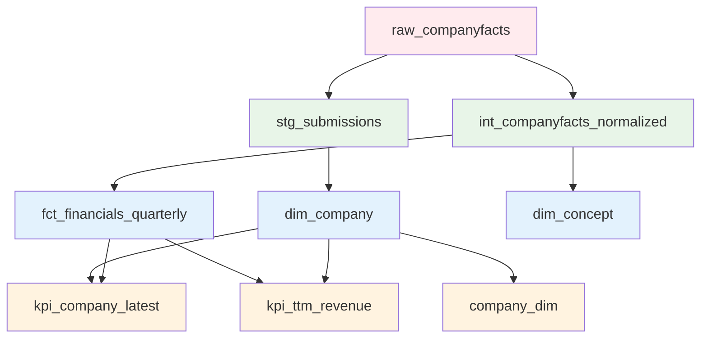

# Data Models Documentation

Complete documentation of all dbt models, schema design, and transformation logic in the SEC EDGAR Financials Warehouse.

## Model Lineage



**Legend:**
- 🔴 **Raw Layer**: Source data from SEC EDGAR API
- 🟢 **Staging Layer**: Initial cleaning and normalization
- 🔵 **Marts Layer**: Business logic and dimensional modeling
- 🟠 **Visualization Layer**: Dashboard-ready aggregations

## Layer 1: Raw Data (`sec_raw`)

### `raw_companyfacts`
**Type**: Table (External data)
**Source**: SEC EDGAR Companyfacts API
**Purpose**: Raw XBRL financial data in JSON format

```sql
CREATE TABLE sec_raw.raw_companyfacts (
  cik STRING,                    -- Company CIK identifier
  entityName STRING,             -- Company legal name
  facts JSON,                    -- Nested XBRL financial facts
  _ingestion_timestamp TIMESTAMP -- When data was loaded
)
```

**Sample Data Structure**:
```json
{
  "cik": "0000320193",
  "entityName": "Apple Inc.",
  "facts": {
    "us-gaap": {
      "Revenues": {
        "units": {
          "USD": [
            {
              "end": "2023-09-30",
              "val": 383285000000,
              "accn": "0000320193-23-000106",
              "fy": 2023,
              "fp": "FY",
              "form": "10-K",
              "filed": "2023-11-03"
            }
          ]
        }
      }
    }
  }
}
```

### `raw_submissions`
**Type**: Table (External data)
**Source**: SEC EDGAR Submissions API
**Purpose**: Company metadata and filing information

```sql
CREATE TABLE sec_raw.raw_submissions (
  cik STRING,                    -- Company CIK identifier
  name STRING,                   -- Company name
  tickers ARRAY<STRING>,         -- Stock ticker symbols
  sic STRING,                    -- Standard Industry Classification
  sicDescription STRING,         -- SIC description
  filings JSON,                  -- Recent filings metadata
  _ingestion_timestamp TIMESTAMP -- When data was loaded
)
```

## Layer 2: Staging Models (`staging/`)

### `stg_submissions`
**Type**: View
**Source**: `raw_submissions`
**Purpose**: Clean and normalize company metadata

```sql
-- File: dbt/models/staging/stg_submissions.sql
with src as (
  select
    SAFE_CAST(cik as string) as cik,
    upper(ticker) as ticker,
    company_name,
    accession_no,
    form,
    SAFE_CAST(filed as date) as filed,
    SAFE_CAST(report_period as date) as report_period
  from {{ source('sec_raw', 'raw_submissions') }}
)
select * from src
```

**Key Transformations**:
- Standardize CIK format (remove leading zeros, cast to string)
- Normalize ticker symbols to uppercase
- Convert date strings to DATE type
- Extract key filing information

**Tests**:
```yaml
models:
  - name: stg_submissions
    columns:
      - name: cik
        tests: [not_null]
      - name: ticker
        tests: [not_null]
      - name: filed
        tests: [not_null]
```

## Layer 3: Intermediate Models (`intermediate/`)

### `int_companyfacts_normalized`
**Type**: View
**Source**: `raw_companyfacts`
**Purpose**: Flatten XBRL JSON structure into relational format

```sql
-- File: dbt/models/intermediate/int_companyfacts_normalized.sql
with flattened as (
  select
    cik,
    entityName as company_name,
    concept_key as concept,
    unit_key as unit,
    SAFE_CAST(fact.end as DATE) as period_end_date,
    SAFE_CAST(fact.val as NUMERIC) as value,
    fact.accn,
    SAFE_CAST(fact.filed as DATE) as filed,
    fact.fy,
    fact.fp,
    fact.form
  from {{ source('sec_raw', 'raw_companyfacts') }},
    UNNEST(JSON_EXTRACT_ARRAY(facts, '$.us-gaap')) as concept_entry,
    UNNEST(JSON_EXTRACT_ARRAY(concept_entry, '$.units')) as unit_entry,
    UNNEST(JSON_EXTRACT_ARRAY(unit_entry)) as fact
)
select * from flattened
where period_end_date is not null
  and value is not null
```

**Key Transformations**:
- Unnest nested JSON arrays into flat structure
- Extract financial concept names (us-gaap:Revenues, etc.)
- Parse unit information (USD, shares, etc.)
- Convert string dates and values to proper types
- Filter out invalid/null data points

**Data Quality Rules**:
- Remove facts without period_end_date
- Remove facts without numeric value
- Standardize concept naming convention
- Validate date ranges (not future dates)

## Layer 4: Marts Models (`marts/`)

### `dim_company`
**Type**: View
**Source**: `stg_submissions`
**Purpose**: Company dimension table for analysis

```sql
-- File: dbt/models/marts/dim_company.sql
select
  cik,
  any_value(company_name) as company_name,
  array_agg(distinct ticker IGNORE NULLS)[offset(0)] as ticker
from {{ ref('stg_submissions') }}
group by cik
```

**Business Logic**:
- One row per company (CIK)
- Handle multiple ticker symbols per company
- Deduplicate company names across filings
- Provide clean lookup table for dashboard filters

**Usage Examples**:
```sql
-- Get all companies
SELECT * FROM dim_company WHERE ticker IS NOT NULL;

-- Company lookup by ticker
SELECT company_name FROM dim_company WHERE ticker = 'AAPL';
```

### `dim_concept`
**Type**: View  
**Source**: `int_companyfacts_normalized`
**Purpose**: Financial concept taxonomy

```sql
-- File: dbt/models/marts/dim_concept.sql
select
  concept,
  count(distinct cik) as company_count,
  count(*) as total_facts,
  min(period_end_date) as earliest_period,
  max(period_end_date) as latest_period
from {{ ref('int_companyfacts_normalized') }}
group by concept
having count(distinct cik) >= 2  -- Only concepts used by multiple companies
```

**Business Logic**:
- Catalog all financial concepts in dataset
- Provide usage statistics for concept popularity
- Filter to commonly used concepts for consistency
- Support concept-level analysis and validation

### `fct_financials_quarterly`
**Type**: Table (Incremental)
**Source**: `int_companyfacts_normalized`
**Purpose**: Core fact table for financial analysis

```sql
-- File: dbt/models/marts/fct_financials_quarterly.sql
{{ config(
    materialized='incremental',
    partition_by={'field': 'period_end_date', 'data_type': 'date'},
    cluster_by=['cik','concept'],
    require_partition_filter=false
) }}

with base as (
  select
    n.cik, n.ticker, n.concept, n.unit,
    n.period_end_date, n.value, n.accn, n.filed, n.fy, n.fp, n.form
  from {{ ref('int_companyfacts_normalized') }} n
  where n.fp in ('Q1','Q2','Q3','Q4') or n.form in ('10-Q','10-K')
)
select * from base

where period_end_date > (select ifnull(max(period_end_date), date('2000-01-01')) from {{ this }})

```

**Schema**:
```sql
CREATE TABLE fct_financials_quarterly (
  cik STRING NOT NULL,           -- Company identifier
  ticker STRING,                 -- Stock symbol
  concept STRING NOT NULL,       -- Financial concept (us-gaap:Revenues)
  unit STRING,                   -- Unit of measurement (USD, shares)
  period_end_date DATE NOT NULL, -- Quarter end date
  value NUMERIC NOT NULL,        -- Financial value
  accn STRING,                   -- SEC accession number
  filed DATE,                    -- Date filed with SEC
  fy INTEGER,                    -- Fiscal year
  fp STRING,                     -- Fiscal period (Q1, Q2, Q3, Q4, FY)
  form STRING                    -- Form type (10-K, 10-Q)
)
PARTITION BY period_end_date
CLUSTER BY (cik, concept)
```

**Incremental Logic**:
- Only process new quarters on subsequent runs
- Uses `period_end_date` as incremental key
- Dramatically reduces processing time for daily updates
- Maintains full historical data

**Business Rules**:
- Only quarterly data (Q1-Q4) and annual summaries (FY)
- Only 10-K and 10-Q forms (excludes amendments)
- Deduplication logic for multiple filings of same period

## Layer 5: Visualization Models (`sec_viz`)

### `kpi_company_latest`
**Type**: Table
**Source**: `fct_financials_quarterly`, `dim_company`
**Purpose**: Latest financial KPIs per company for dashboards

```sql
-- File: dbt/models/marts_viz/kpi_company_latest.sql
{{ config(materialized='table', schema=var('BQ_VIZ_DATASET', 'sec_viz')) }}

-- Revenue concepts (USD-ish only), pick a preferred one per (cik, period)
WITH rev_candidates AS (
  SELECT cik, ticker, period_end_date, concept, unit, value
  FROM `sec-edgar-financials-warehouse.sec_curated_sec_curated.fct_financials_quarterly`
  WHERE concept IN (
    'us-gaap:Revenues',
    'us-gaap:SalesRevenueNet',
    'us-gaap:RevenueFromContractWithCustomerExcludingAssessedTax'
  )
  AND (unit IS NULL OR UPPER(unit) LIKE '%USD%')
  AND period_end_date IS NOT NULL
  AND value IS NOT NULL
),

-- 🔑 latest period that actually HAS revenue (per company)
last_rev_period AS (
  SELECT cik, MAX(period_end_date) AS last_period
  FROM rev_pref
  GROUP BY cik
)

SELECT
  lr.cik,
  COALESCE(r.ticker, d.ticker) AS ticker,
  lr.last_period AS period_end_date,
  r.revenue,
  g.gross_profit,
  n.net_income,
  SAFE_DIVIDE(g.gross_profit, r.revenue) AS gross_margin,
  SAFE_DIVIDE(n.net_income, r.revenue) AS net_margin
FROM last_rev_period lr
JOIN rev_pref r ON r.cik = lr.cik AND r.period_end_date = lr.last_period
-- ... additional joins for gross profit, net income
```

**Key Features**:
- **Revenue-Anchored**: Uses latest period WITH revenue (not just latest period)
- **Ticker Fallback**: COALESCE ensures ticker is never null for dashboards
- **Multiple Metrics**: Revenue, gross profit, net income with calculated margins
- **Preference Logic**: Prioritizes 'us-gaap:Revenues' over other revenue concepts

**Output**: 5 rows (one per company) with guaranteed non-null revenue

### `kpi_ttm_revenue`
**Type**: Table (Partitioned)
**Source**: `fct_financials_quarterly`, `dim_company`
**Purpose**: Trailing twelve months revenue calculations

```sql
-- File: dbt/models/marts_viz/kpi_ttm_revenue.sql
{{ config(
  materialized='table',
  partition_by={'field': 'period_end_date', 'data_type': 'date'},
  cluster_by=['cik'],
  schema=var('BQ_VIZ_DATASET', 'sec_viz')
) }}

WITH rev_with_ticker AS (
  SELECT
    r.cik,
    COALESCE(r.ticker, d.ticker) AS ticker,
    r.period_end_date,
    r.revenue
  FROM rev r
  LEFT JOIN `sec-edgar-financials-warehouse.sec_curated_sec_curated.dim_company` d
    ON d.cik = r.cik
)
SELECT
  cik, ticker, period_end_date,
  SUM(revenue) OVER (
    PARTITION BY cik
    ORDER BY period_end_date
    ROWS BETWEEN 3 PRECEDING AND CURRENT ROW
  ) AS ttm_revenue
FROM rev_with_ticker
WHERE period_end_date >= DATE_SUB(CURRENT_DATE(), INTERVAL 10 YEAR)
QUALIFY ttm_revenue IS NOT NULL
```

**Key Features**:
- **Window Function**: Rolling 4-quarter sum for TTM calculation
- **Performance**: Partitioned by date, clustered by company
- **Complete Series**: Ticker fallback ensures no missing identifiers
- **Historical Depth**: 10-year lookback for comprehensive analysis

**Output**: 98 rows across all companies and time periods

### `company_dim`
**Type**: Table
**Source**: `dim_company`, `fct_financials_quarterly`
**Purpose**: Enhanced company dimension for dashboard filtering

```sql
-- File: dbt/models/marts_viz/company_dim.sql
SELECT
  d.cik,
  d.ticker,
  d.company_name,
  l.latest_filing_date,
  l.total_quarters_filed,
  COALESCE(rs.revenue_quarters_count, 0) as revenue_quarters_count,
  CASE 
    WHEN rs.revenue_quarters_count >= 4 THEN 'Active'
    WHEN rs.revenue_quarters_count >= 1 THEN 'Limited Data'
    ELSE 'No Revenue Data'
  END as data_completeness
FROM {{ ref('dim_company') }} d
-- ... joins for filing and revenue statistics
```

**Key Features**:
- **Data Quality Assessment**: Categorizes companies by data completeness
- **Filing Statistics**: Count of total quarters and revenue quarters available
- **Dashboard Filtering**: Enables filtering by data quality level

## Data Quality Framework

### dbt Tests Configuration

```yaml
# File: dbt/models/marts_viz/viz.yml
version: 2
models:
  - name: kpi_company_latest
    columns:
      - name: cik
        tests: [not_null, unique]
      - name: period_end_date
        tests: [not_null]
      - name: revenue
        tests: [not_null]   # Safe because revenue-anchored

  - name: kpi_ttm_revenue
    columns:
      - name: cik
        tests: [not_null]
      - name: ticker
        tests: [not_null]
      - name: ttm_revenue
        tests: [not_null]
```

### Custom Tests

```sql
-- File: dbt/tests/assert_revenue_positive.sql
-- Test that all revenue values are positive
SELECT cik, period_end_date, value
FROM {{ ref('fct_financials_quarterly') }}
WHERE concept = 'us-gaap:Revenues'
  AND value <= 0
```

### Great Expectations Integration

```python
# File: src/dq/run_ge_checks.py
import great_expectations as ge

# Data quality expectations
def validate_financials_quarterly():
    df = ge.read_bigquery('SELECT * FROM fct_financials_quarterly')
    
    # Core data quality checks
    df.expect_column_to_exist('cik')
    df.expect_column_values_to_not_be_null('cik')
    df.expect_column_values_to_not_be_null('period_end_date')
    df.expect_column_values_to_be_between('value', min_value=0)
    
    # Business logic checks
    df.expect_column_values_to_be_in_set('fp', ['Q1', 'Q2', 'Q3', 'Q4', 'FY'])
    df.expect_column_values_to_match_regex('concept', r'^us-gaap:')
    
    return df.validate()
```

## Performance Optimization

### BigQuery Optimization Strategies

1. **Partitioning**:
   - All fact tables partitioned by `period_end_date`
   - Enables date range filtering with automatic partition pruning
   - Reduces query costs for time-series analysis

2. **Clustering**:
   - Primary cluster on `cik` for company-level analysis
   - Secondary cluster on `concept` for metric-level analysis
   - Optimizes for common dashboard query patterns

3. **Incremental Processing**:
   - `fct_financials_quarterly` uses incremental materialization
   - Only processes new quarters, not full historical rebuild
   - Reduces daily processing time from 10+ minutes to <2 minutes

### Query Pattern Optimization

```sql
-- Optimized query pattern for dashboards
SELECT 
  ticker,
  period_end_date,
  revenue,
  ttm_revenue
FROM `sec_viz.kpi_company_latest` c
JOIN `sec_viz.kpi_ttm_revenue` t USING (cik)
WHERE period_end_date >= '2023-01-01'  -- Partition filter
  AND ticker IN ('AAPL', 'MSFT', 'GOOGL')  -- Cluster optimization
ORDER BY period_end_date DESC
```

## Schema Evolution Management

### Backward Compatibility

1. **Additive Changes Only**:
   - New columns added as nullable
   - Existing columns never removed or renamed
   - Data types only widened (INTEGER → NUMERIC)

2. **Version Control**:
   - All schema changes tracked in dbt models
   - Git history provides complete audit trail
   - Rollback capability via dbt model versioning

### Migration Strategies

```sql
-- Example: Adding new metric to visualization layer
-- File: dbt/models/marts_viz/kpi_company_latest_v2.sql
SELECT 
  *,  -- All existing columns
  SAFE_DIVIDE(operating_income, revenue) as operating_margin  -- New column
FROM {{ ref('kpi_company_latest') }}
LEFT JOIN operating_income_data USING (cik, period_end_date)
```

## Model Governance

### Naming Conventions

- **Raw**: `raw_{source_name}` (e.g., `raw_companyfacts`)
- **Staging**: `stg_{source_name}` (e.g., `stg_submissions`)
- **Intermediate**: `int_{business_concept}` (e.g., `int_companyfacts_normalized`)
- **Marts**: `{type}_{business_object}` (e.g., `dim_company`, `fct_financials_quarterly`)
- **Visualization**: `{purpose}_{business_object}` (e.g., `kpi_company_latest`)

### Documentation Standards

Every model includes:
- Business purpose and use cases
- Data lineage and dependencies
- Key transformations and business logic
- Data quality tests and validation rules
- Performance characteristics and optimization
- Change history and versioning information